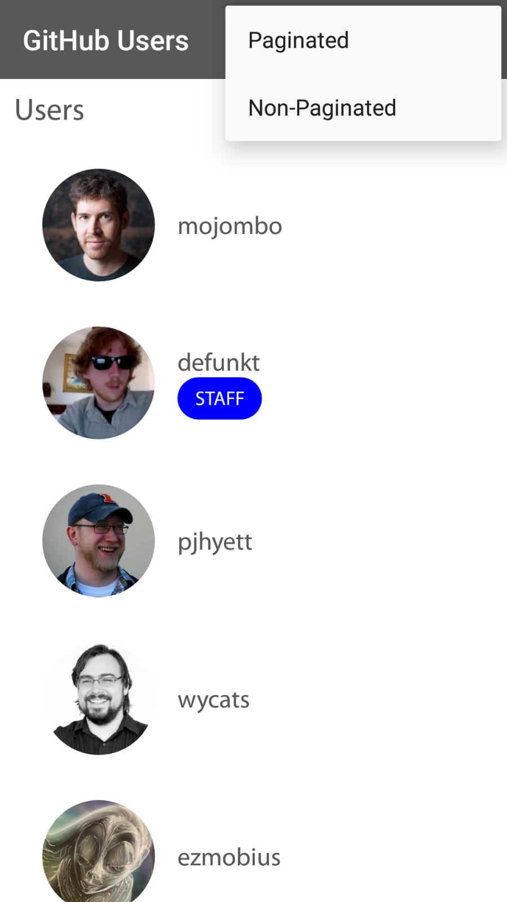
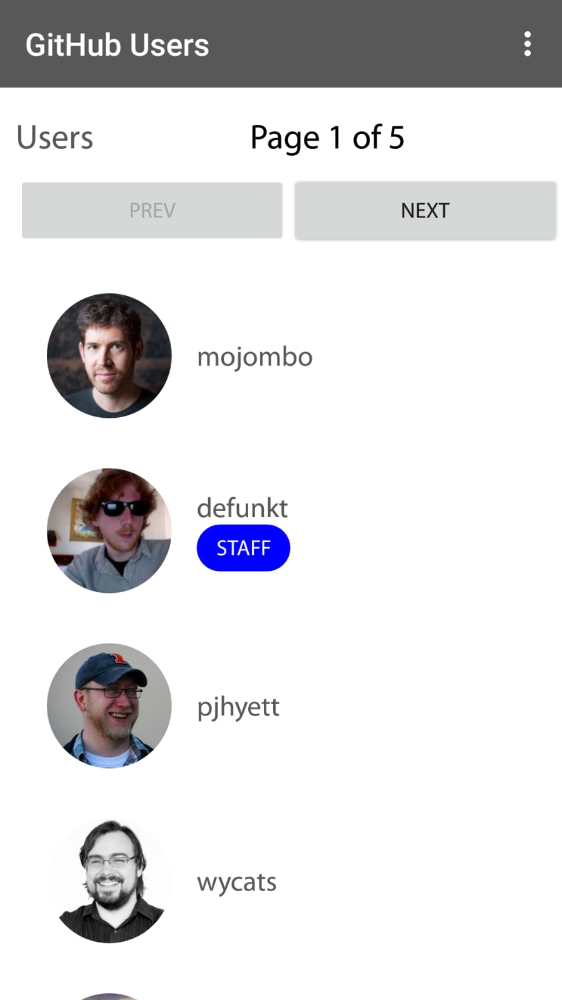

# Assignment
This Assignment was using MVP Structure and implements by Rxjava, Retrofit and Dagger.

## Environment
* Android Studio 3.0.1
* Support SDK 19 to 26

### Design Structure 
* Provide 2 different option for user
* Non-Paginated option
  * Allow user to scroll down to load more data and limit is 100 items.
  * Allow user to swipe refresh data.

* Paginated option
  * Allow user to click page to view info and page size is 20.
  * Allow user to swipe refresh data.

